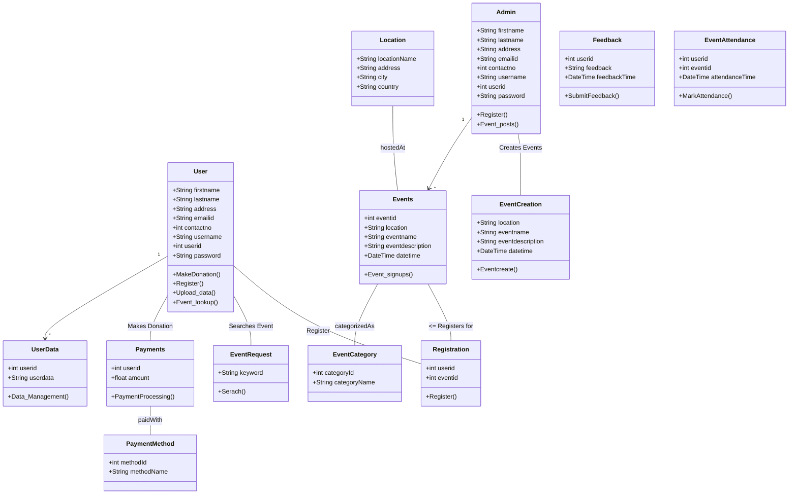

# Carbon Emission Tracker
 
## Overview

The Carbon Emission Tracker is a web application designed to educate the users to gain better understanding and combat the
issues of Carbon pollutioning. The website includes features such as User **Signin** and **Authentication**, User Data **Collection** 
and **Visualization**, **Event Signup**, and user **Email subscriptions**. The server-side(backend) code is supported by **express**, **Nodejs** and 
**MongoDB**. While the client-side(frontend) code are supported by **React** and **Vite**.
 
## Features
 
- **User Authentication**: Users can sign up, log in, and create accounts to access the platform's features.

- **Data Collection and Analysis**: The platform collects data on carbon emissions from different sources, analyzes it, and presents insights through visual representations.

- **Educational Content**: Informational pages provide educational resources about carbon emissions and their environmental impacts.

- **Responsive Design**: The web application is designed to be accessible and functional on both computers and mobile devices.

- **Event Management**: Users can search for Events through keywords

- **Event Registration**: Users can search for events based on keywords, view event details, and register to attend. Upon registration, they receive confirmation emails.

- **Carbon Emission Data Display**: The platform may display available data on carbon emissions, aiding users in understanding the impact of various activities.
 
- **Mailing System**: Subscription based newsletters for user to sign up and receive emails
 
## Team members:

song.zeh@northeastern.edu , Zehao Song

naik.amr@northeastern.edu , Amruta Naik

pillai.pr@northeastern.edu , Prathush Shivprasad Pillai

## Installation
- Pull from the main branches, the code consists of all front-end and back-end codes
- Download the necessary libraries described in the DevLog files, set up the.env files to run on your local MongoDB
- the server can be set up running `node server.js`, while the client side can be set up using `npm run dev`

## Object Model

The object model for the Carbon Emission Tracker is represented using Mermaid syntax:

