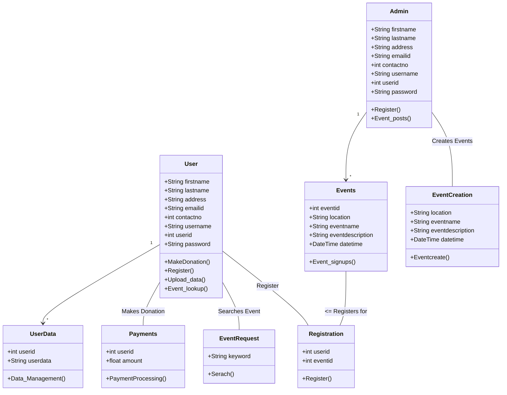

[Yesterday 20:45] Amruta Naik
# Object project

```mermaid
 
---
 
Object Model for course registration
 
---
 
classDiagram
User -- Registration: Register
User -- EventRequest: Searches Event
User -- Payments: Makes Donation
Admin -- EventCreation: Creates Events
Events -- Registration: <= Registers for
User "1" --> "*" UserData
Admin "1" --> "*" Events
 
  class User{
    +String firstname
    +String lastname
    +String address
    +String emailid
    +int contactno
    +String username
    +int userid
    +String password
    +MakeDonation()
    +Register()
    +Upload_data()
    +Event_lookup()
 
  }
 
  class Admin{
    +String firstname
    +String lastname
    +String address
    +String emailid
    +int contactno
    +String username
    +int userid
    +String password
    +Register()
    +Event_posts()
  }
 
  class Events{
       +int eventid
       +String location
       +String eventname
       +String eventdescription
       +DateTime datetime
       +Event_signups()
  }
 
  class EventRequest{
    +String keyword
    +Serach()
  }
 
  class UserData{
    +int userid
    +String userdata
    +Data_Management()
  }
 
  class Registration{
    +int userid
    +int eventid
    +Register()
  }
 
  class Payments{
    +int userid
    +float amount
    +PaymentProcessing()
 
}
 
class EventCreation{
    +String location
    +String eventname
    +String eventdescription
    +DateTime datetime
    +Eventcreate()
}
 
 
 
```
 
 
 
 